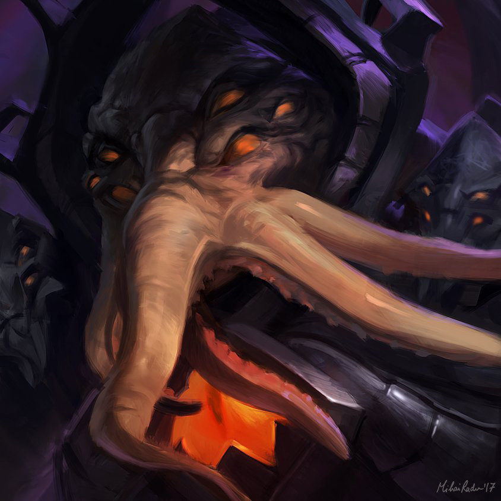
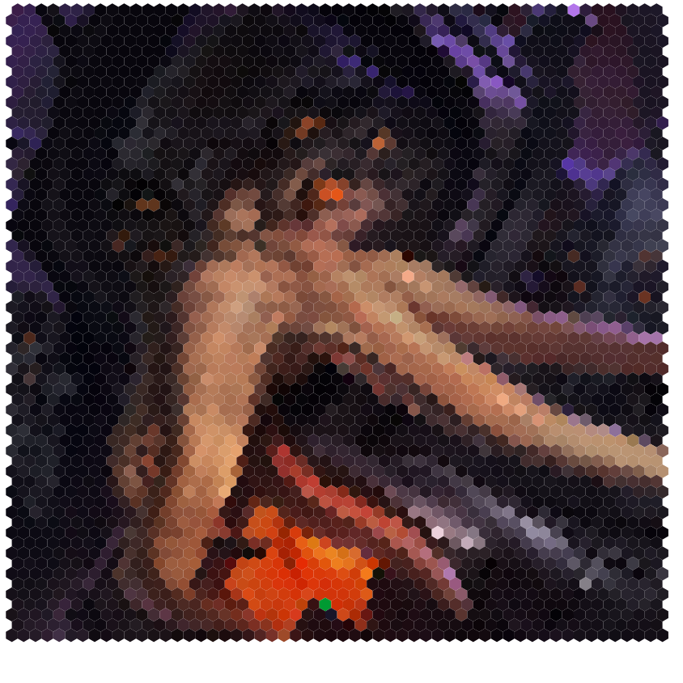

## Vincent Van Go

> Posts a generated image to Twitter

The original goal was to generate an image and upload it to twitter.

The program can also generate hexagon tiles from an image.

## TODO

- Average out pixels in the area to get more accurate hexagon colors
- Build into CLI tool with flags for image input and hexagon percentage
